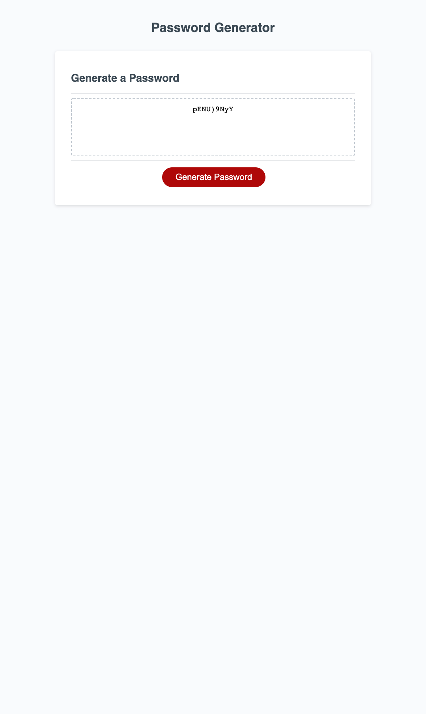

# Password Generator Starter Code
This challenge was to use javascript to build a random password generator prompting users to select their desired password length and character types and then allowing them to click a button that would generate a random password to their specifications.

## Deployment can be found here:
https://bleakney.github.io/password-generator

## Screenshot of deployment:
